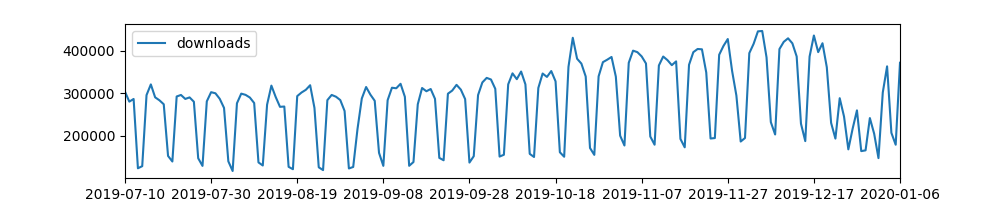
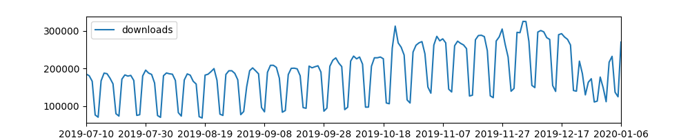

# pypistats

[](https://pypi.org/project/pypistats/)
[](https://pypi.org/project/pypistats/)
[](https://pypistats.org/packages/pypistats)
[](https://dev.azure.com/hugovk/hugovk/_build?definitionId=1)
[](https://github.com/hugovk/pypistats/actions)
[](https://codecov.io/gh/hugovk/pypistats)
[](LICENSE.txt)
[](https://zenodo.org/badge/latestdoi/149862343)
[](https://github.com/psf/black)

Python interface to [PyPI Stats API](https://pypistats.org/api) to get aggregate
download statistics on Python packages on the Python Package Index without having to
execute queries directly against Google BigQuery.

Data is available for the [last 180 days](https://pypistats.org/about#data). (For longer
time periods, [pypinfo](https://github.com/ofek/pypinfo) can help, you'll need an API
key and get free quota.)

## Installation

### From PyPI

```bash
python3 -m pip install --upgrade pypistats
```

### From source

```bash
git clone https://github.com/hugovk/pypistats
cd pypistats
python3 -m pip install .
```

## Example command-line use

Run `pypistats` with a subcommand (corresponding to
[PyPI Stats endpoints](https://pypistats.org/api/#endpoints)), then options for that
subcommand.

Top-level help:

<!-- [[[cog
from scripts.run_command import run
run("pypistats --help")
]]] -->

```console
$ pypistats --help
usage: pypistats [-h] [-V]
                 {recent,overall,python_major,python_minor,system} ...

positional arguments:
  {recent,overall,python_major,python_minor,system}

options:
  -h, --help            show this help message and exit
  -V, --version         show program's version number and exit
```

<!-- [[[end]]] -->

Help for a subcommand:

<!-- [[[cog run("pypistats recent --help") ]]] -->

```console
$ pypistats recent --help
usage: pypistats recent [-h] [-p {day,week,month}]
                        [-f {html,json,pretty,md,markdown,rst,tsv}] [-j]
                        [-v]
                        package

Retrieve the aggregate download quantities for the last day/week/month

positional arguments:
  package

options:
  -h, --help            show this help message and exit
  -p {day,week,month}, --period {day,week,month}
  -f {html,json,pretty,md,markdown,rst,tsv}, --format {html,json,pretty,md,markdown,rst,tsv}
                        The format of output (default: pretty)
  -j, --json            Shortcut for "-f json" (default: False)
  -v, --verbose         Print debug messages to stderr (default: False)
```

<!-- [[[end]]] -->

Get recent downloads:

<!-- [[[cog run("pypistats recent pillow") ]]] -->

```console
$ pypistats recent pillow
┌───────────┬────────────┬────────────┐
│  last_day │ last_month │  last_week │
├───────────┼────────────┼────────────┤
│ 3,419,597 │ 91,237,125 │ 21,259,217 │
└───────────┴────────────┴────────────┘
```

<!-- [[[end]]] -->

Help for another subcommand:

<!-- [[[cog run("pypistats python_minor --help") ]]] -->

```console
$ pypistats python_minor --help
usage: pypistats python_minor [-h] [-V VERSION]
                              [-f {html,json,pretty,md,markdown,rst,tsv}]
                              [-j] [-sd yyyy-mm[-dd]|name]
                              [-ed yyyy-mm[-dd]|name] [-m yyyy-mm|name] [-l]
                              [-t] [-d] [--monthly] [-c {yes,no,auto}] [-v]
                              package

Retrieve the aggregate daily download time series by Python minor version
number

positional arguments:
  package

options:
  -h, --help            show this help message and exit
  -V VERSION, --version VERSION
                        eg. 2.7 or 3.6 (default: None)
  -f {html,json,pretty,md,markdown,rst,tsv}, --format {html,json,pretty,md,markdown,rst,tsv}
                        The format of output (default: pretty)
  -j, --json            Shortcut for "-f json" (default: False)
  -sd yyyy-mm[-dd]|name, --start-date yyyy-mm[-dd]|name
                        Start date (default: None)
  -ed yyyy-mm[-dd]|name, --end-date yyyy-mm[-dd]|name
                        End date (default: None)
  -m yyyy-mm|name, --month yyyy-mm|name
                        Shortcut for -sd & -ed for a single month (default:
                        None)
  -l, --last-month      Shortcut for -sd & -ed for last month (default: False)
  -t, --this-month      Shortcut for -sd for this month (default: False)
  -d, --daily           Show daily downloads (default: False)
  --monthly             Show monthly downloads (default: False)
  -c {yes,no,auto}, --color {yes,no,auto}
                        Color terminal output (default: auto)
  -v, --verbose         Print debug messages to stderr (default: False)
```

<!-- [[[end]]] -->

Get version downloads:

<!-- [[[cog run("pypistats python_minor pillow --last-month") ]]] -->

```console
$ pypistats python_minor pillow --last-month
┌──────────┬─────────┬────────────┐
│ category │ percent │  downloads │
├──────────┼─────────┼────────────┤
│ 3.8      │  18.37% │ 16,161,117 │
│ 3.10     │  17.47% │ 15,373,666 │
│ 3.7      │  16.70% │ 14,691,371 │
│ 3.11     │  15.49% │ 13,630,259 │
│ 3.9      │  13.19% │ 11,605,389 │
│ 3.6      │   9.68% │  8,519,789 │
│ null     │   4.64% │  4,085,994 │
│ 3.12     │   3.26% │  2,871,386 │
│ 2.7      │   0.95% │    837,638 │
│ 3.5      │   0.25% │    216,308 │
│ 3.13     │   0.00% │      2,830 │
│ 3.4      │   0.00% │      1,237 │
│ 3.3      │   0.00% │        109 │
│ 3.1      │   0.00% │          3 │
│ 3.2      │   0.00% │          2 │
│ Total    │         │ 87,997,098 │
└──────────┴─────────┴────────────┘

Date range: 2024-02-01 - 2024-02-29
```

<!-- [[[end]]] -->

You can format in Markdown, ready for pasting in GitHub issues and PRs:

<!-- [[[cog run("pypistats python_minor pillow --last-month --format md", with_console=False) ]]] -->

| category | percent |  downloads |
| :------- | ------: | ---------: |
| 3.8      |  18.37% | 16,161,117 |
| 3.10     |  17.47% | 15,373,666 |
| 3.7      |  16.70% | 14,691,371 |
| 3.11     |  15.49% | 13,630,259 |
| 3.9      |  13.19% | 11,605,389 |
| 3.6      |   9.68% |  8,519,789 |
| null     |   4.64% |  4,085,994 |
| 3.12     |   3.26% |  2,871,386 |
| 2.7      |   0.95% |    837,638 |
| 3.5      |   0.25% |    216,308 |
| 3.13     |   0.00% |      2,830 |
| 3.4      |   0.00% |      1,237 |
| 3.3      |   0.00% |        109 |
| 3.1      |   0.00% |          3 |
| 3.2      |   0.00% |          2 |
| Total    |         | 87,997,098 |

Date range: 2024-02-01 - 2024-02-29

<!-- [[[end]]] -->

These are equivalent (in May 2019):

```sh
pypistats python_major pip --last-month
pypistats python_major pip --month april
pypistats python_major pip --month apr
pypistats python_major pip --month 2019-04
```

And:

```sh
pypistats python_major pip --start-date december --end-date january
pypistats python_major pip --start-date dec      --end-date jan
pypistats python_major pip --start-date 2018-12  --end-date 2019-01
```

## Example programmatic use

Return values are from the JSON responses documented in the API:
https://pypistats.org/api/

```python
import pypistats
from pprint import pprint

# Call the API
print(pypistats.recent("pillow"))
print(pypistats.recent("pillow", "day", format="markdown"))
print(pypistats.recent("pillow", "week", format="rst"))
print(pypistats.recent("pillow", "month", format="html"))
pprint(pypistats.recent("pillow", "week", format="json"))
print(pypistats.recent("pillow", "day"))

print(pypistats.overall("pillow"))
print(pypistats.overall("pillow", mirrors=True, format="markdown"))
print(pypistats.overall("pillow", mirrors=False, format="rst"))
print(pypistats.overall("pillow", mirrors=True, format="html"))
pprint(pypistats.overall("pillow", mirrors=False, format="json"))

print(pypistats.python_major("pillow"))
print(pypistats.python_major("pillow", version=2, format="markdown"))
print(pypistats.python_major("pillow", version=3, format="rst"))
print(pypistats.python_major("pillow", version="2", format="html"))
pprint(pypistats.python_major("pillow", version="3", format="json"))

print(pypistats.python_minor("pillow"))
print(pypistats.python_minor("pillow", version=2.7, format="markdown"))
print(pypistats.python_minor("pillow", version="2.7", format="rst"))
print(pypistats.python_minor("pillow", version=3.7, format="html"))
pprint(pypistats.python_minor("pillow", version="3.7", format="json"))

print(pypistats.system("pillow"))
print(pypistats.system("pillow", os="darwin", format="markdown"))
print(pypistats.system("pillow", os="linux", format="rst"))
print(pypistats.system("pillow", os="darwin", format="html"))
pprint(pypistats.system("pillow", os="linux", format="json"))
```

### NumPy and pandas

To use with either NumPy or pandas, make sure they are first installed, or:

```bash
pip install --upgrade "pypistats[numpy]"
pip install --upgrade "pypistats[pandas]"
pip install --upgrade "pypistats[numpy,pandas]"
```

Return data in a NumPy array for further processing:

```python
import pypistats
numpy_array = pypistats.overall("pyvista", total=True, format="numpy")
print(type(numpy_array))
# <class 'numpy.ndarray'>
print(numpy_array)
# [['with_mirrors' '2019-09-20' '2.23%' 1204]
#  ['without_mirrors' '2019-09-20' '2.08%' 1122]
#  ['with_mirrors' '2019-09-19' '0.92%' 496]
#  ...
#  ['with_mirrors' '2019-10-26' '0.02%' 13]
#  ['without_mirrors' '2019-10-26' '0.02%' 12]
#  ['Total' None None 54041]]
```

Or in a pandas DataFrame:

```python
import pypistats
pandas_dataframe = pypistats.overall("pyvista", total=True, format="pandas")
print(type(pandas_dataframe))
# <class 'pandas.core.frame.DataFrame'>
print(pandas_dataframe)
#             category        date percent  downloads
# 0       with_mirrors  2019-09-20   2.23%       1204
# 1    without_mirrors  2019-09-20   2.08%       1122
# 2       with_mirrors  2019-09-19   0.92%        496
# 3       with_mirrors  2019-08-22   0.90%        489
# 4    without_mirrors  2019-09-19   0.86%        466
# ..               ...         ...     ...        ...
# 354  without_mirrors  2019-11-03   0.03%         15
# 355  without_mirrors  2019-11-16   0.03%         15
# 356     with_mirrors  2019-10-26   0.02%         13
# 357  without_mirrors  2019-10-26   0.02%         12
# 358            Total        None    None      54041
#
# [359 rows x 4 columns]
```

For example, create charts with pandas:

```python
# Show overall downloads over time, excluding mirrors
import pypistats
data = pypistats.overall("pillow", total=True, format="pandas")
data = data.groupby("category").get_group("without_mirrors").sort_values("date")

chart = data.plot(x="date", y="downloads", figsize=(10, 2))
chart.figure.show()
chart.figure.savefig("overall.png")  # alternatively
```



```python
# Show Python 3 downloads over time
import pypistats
data = pypistats.python_major("pillow", total=True, format="pandas")
data = data.groupby("category").get_group(3).sort_values("date")

chart = data.plot(x="date", y="downloads", figsize=(10, 2))
chart.figure.show()
chart.figure.savefig("python3.png")  # alternatively
```



## See also

Related projects

- https://github.com/ofek/pypinfo
- https://github.com/scivision/pypistats-plots
